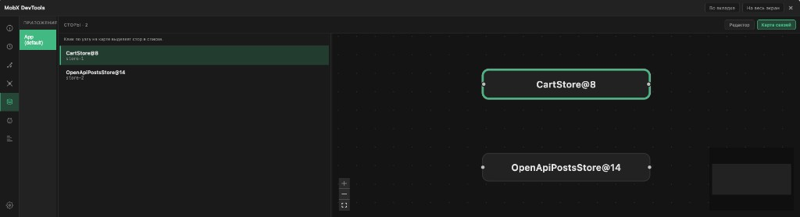
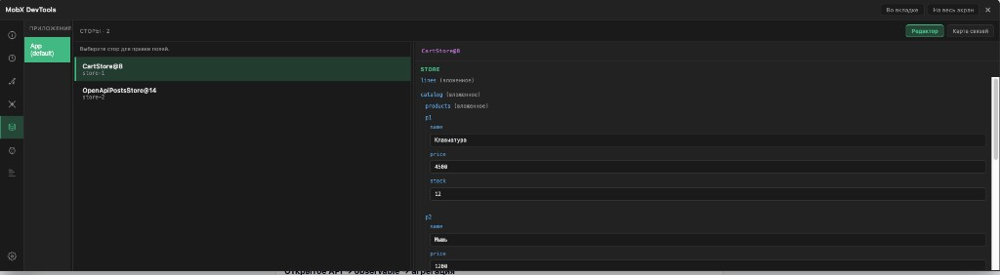
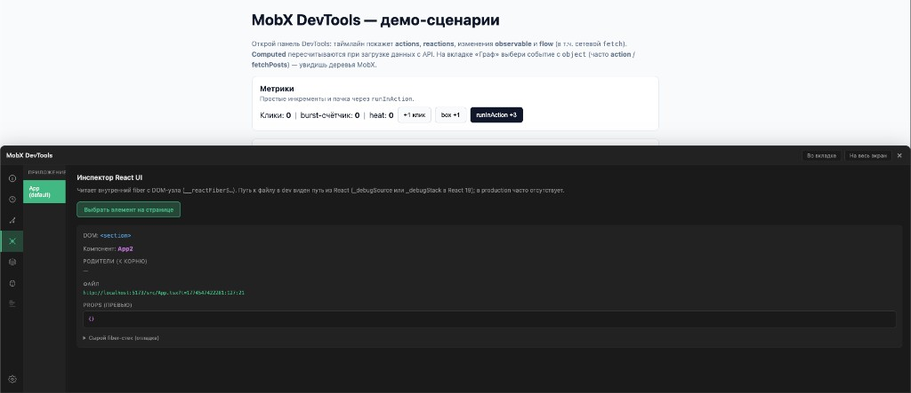

# MobX DevTools

Оверлей для отладки [MobX](https://mobx.js.org/) во время разработки: таймлайн `spy`, инспектор сторов, граф зависимостей, React UI inspector, поиск «мёртвого» state и анализ структуры сторов.

**Репозиторий:** [github.com/pyrocancode/mobx-devtools](https://github.com/pyrocancode/mobx-devtools)

> Работает только с **development-сборкой MobX** (`spy` в production отключён).

---

## Скриншоты

<p align="center">
  <b>Вкладка «Сторы» — карта связей между сторами</b> (React Flow + dagre)<br/>
  
</p>

<p align="center">
  <b>Вкладка «Сторы» — редактор полей</b><br/>
  
</p>

<p align="center">
  <b>Вкладка «UI» — инспектор React</b> (fiber, props, путь к файлу в dev)<br/>
  
</p>

---

## Возможности

| Область | Что есть |
|--------|-----------|
| **Таймлайн** | События `spy`, фильтры по типу, поиск, Explain, JSON |
| **Граф** | Деревья зависимостей и наблюдателей MobX по событию |
| **UI** | Выбор DOM-узла, цепочка компонентов, превью props, путь к исходнику (React 18 / 19) |
| **Сторы** | Реестр из `spy`, правка примитивов, **карта связей** между сторами |
| **Зомби** | Observable / computed без наблюдателей |
| **Структура** | Размер стора, вложенность, ширина объектов, циклы в графе зависимостей |
| **Remote** | Отдельная вкладка браузера через `BroadcastChannel` |

---

## Структура монорепозитория

```
mobx-devtools/
  packages/
    sdk/          # spy, буфер событий, реестр сторов, анализаторы
    ui/           # React-оверлей (@xyflow/react для графа сторов)
  examples/
    react-app/    # демо на Vite
  docs/
    screenshots/  # иллюстрации для README
```

---

## Быстрый старт (демо)

```bash
git clone https://github.com/pyrocancode/mobx-devtools.git
cd mobx-devtools
npm install
npm run dev
```

Откроется приложение на [Vite](https://vitejs.dev/) (`examples/react-app`): снизу — плавающая панель DevTools.

Сборка всех пакетов:

```bash
npm run build
npm run typecheck
```

---

## Подключение к своему React-приложению

### 1. Зависимости

Установите пакеты из этого репозитория (пути подставьте свои):

```json
{
  "dependencies": {
    "@mobx-devtools/sdk": "file:../mobx-devtools/packages/sdk",
    "@mobx-devtools/ui": "file:../mobx-devtools/packages/ui",
    "mobx": "^6.13.0",
    "react": "^18.0.0 || ^19.0.0",
    "react-dom": "^18.0.0 || ^19.0.0"
  }
}
```

После публикации в npm можно будет заменить на версии из реестра.

### 2. Компонент в дереве React

`MobxDevtools` при монтировании вызывает `initMobxDevtools()` (включает глобальный `spy`). Достаточно один раз отрендерить его рядом с корнем приложения (например в `App`):

```tsx
import { MobxDevtools } from "@mobx-devtools/ui";

export function App() {
  return (
    <>
      {/* ваше приложение */}
      <MobxDevtools />
    </>
  );
}
```

Опции (см. тип `MobxDevtoolsProps`):

- `initialIsOpen` — открыть панель сразу
- `position` — `bottom-left` | `bottom-right` | `top-left` | `top-right`
- `mode` — `embedded` (по умолчанию) или `remote` для зеркальной вкладки
- `standaloneDevtoolsHref` — URL страницы с `<MobxDevtools mode="remote" />` (кнопка «Во вкладке»)

### 3. Реестр сторов

Корневые **классовые** сторы с `makeAutoObservable` часто попадают в реестр автоматически (через `object` в событиях `spy`).

Явная регистрация для plain `observable({ ... })` или если стор не попал в список:

```tsx
import { registerRootStore } from "@mobx-devtools/sdk";

registerRootStore(myStore);
```

### 4. Отдельная вкладка (опционально)

В основном окне:

```tsx
<MobxDevtools standaloneDevtoolsHref="/devtools.html" />
```

Отдельная страница (например `devtools.html` + точка входа) рендерит:

```tsx
import { connectDevtoolsRemote, MobxDevtools } from "@mobx-devtools/ui";

connectDevtoolsRemote();

export function DevtoolsApp() {
  return <MobxDevtools mode="remote" initialIsOpen />;
}
```

Синхронизация — через `BroadcastChannel` в пределах одного origin.

---

## API SDK (выборочно)

Импорт из `@mobx-devtools/sdk`:

- `initMobxDevtools`, `subscribe`, `getRecentEvents`, `clearEvents`, `setMaxEvents`
- `registerRootStore`, `getRegisteredStores`, `subscribeStores`, `clearStoreRegistry`
- `explainSubject`, `getDependencyTree`, `getObserverTree`
- `scanZombieObservables`, `analyzeStoreStructure`, `buildMultiStoreLinkGraph`
- Remote: `connectDevtoolsRemote`, `subscribeRemote`, …

---

## Лицензия

MIT — см. файл [LICENSE](./LICENSE) в репозитории.
